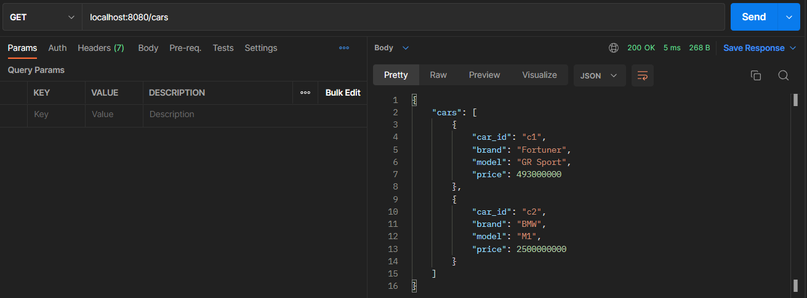
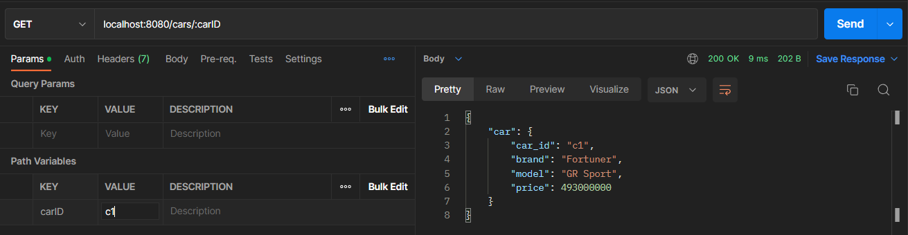
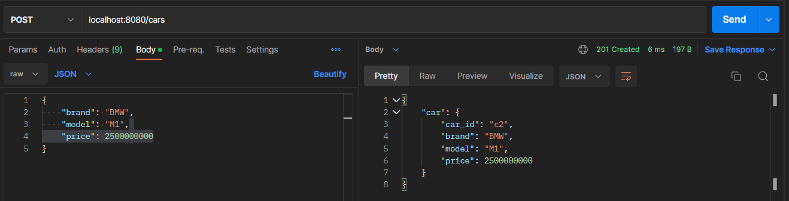
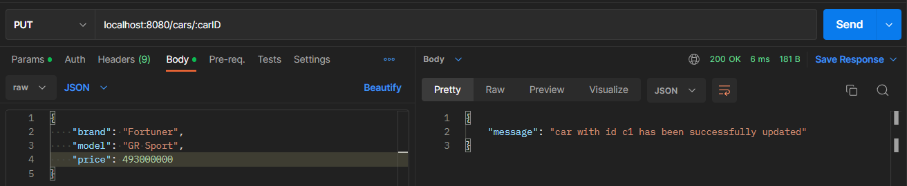
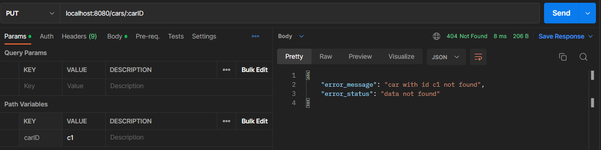
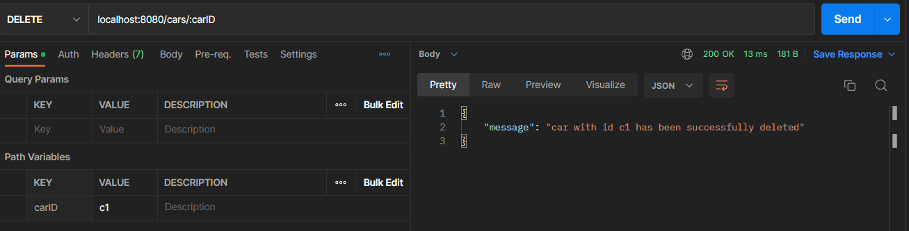
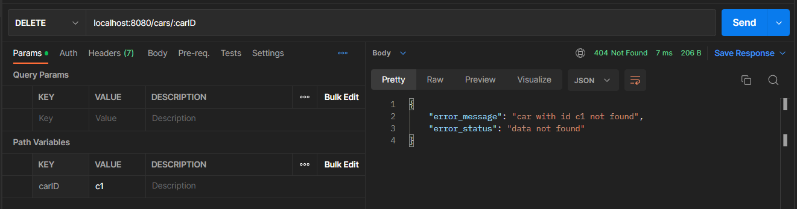

## Simple Web Service with Golang, Gin Framework
Gin framework introduction, create a simple Rest API that will do the CRUD of car data.

How to start service:
```
go run main.go
```

### Get Cars


### Get Car By ID


### Add New Car


### Update Car
Success:


Not found:


### Delete Car
Success:


Not found:

